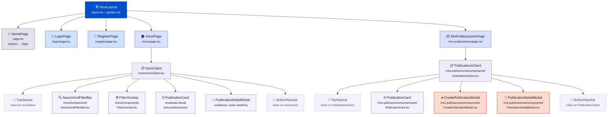

# Árbol de Componentes — Sprint 1

```mermaid
graph TD
    Root["🏗️ RootLayout<br/><small>layout.tsx + globals.css</small>"]

    Root --> Home["🔀 HomePage<br/><small>page.tsx</small><br/><small>redirect → /login</small>"]

    Root --> Login["🔐 LoginPage<br/><small>/login/page.tsx</small>"]

    Root --> Register["📝 RegisterPage<br/><small>/register/page.tsx</small>"]

    Root --> InicioPage["🏠 InicioPage<br/><small>/inicio/page.tsx</small>"]
    InicioPage --> InicioClient["📋 InicioClient<br/><small>/inicio/InicioClient.tsx</small>"]

    InicioClient --> TopNav_I["🧭 TopNavbar<br/><small>inline en InicioClient</small>"]
    InicioClient --> SearchBar["🔍 SearchAndFilterBar<br/><small>/inicio/components/<br/>SearchAndFilterBar.tsx</small>"]
    InicioClient --> FilterOv["⚙️ FilterOverlay<br/><small>/inicio/components/<br/>FilterOverlay.tsx</small>"]
    InicioClient --> PubCard_I["🃏 PublicationCard<br/><small>reutilizado desde<br/>/mis-publicaciones/</small>"]
    InicioClient --> DetailM_I["📄 PublicationDetailModal<br/><small>reutilizado, modo readOnly</small>"]
    InicioClient --> BotNav_I["📱 BottomNavbar<br/><small>inline en InicioClient</small>"]

    Root --> MisPubPage["📦 MisPublicacionesPage<br/><small>/mis-publicaciones/page.tsx</small>"]
    MisPubPage --> PubClient["📋 PublicationsClient<br/><small>/mis-publicaciones/components/<br/>PublicationsClient.tsx</small>"]

    PubClient --> TopNav_P["🧭 TopNavbar<br/><small>inline en PublicationsClient</small>"]
    PubClient --> PubCard["🃏 PublicationCard<br/><small>/mis-publicaciones/components/<br/>PublicationCard.tsx</small>"]
    PubClient --> CreateModal["➕ CreatePublicationModal<br/><small>/mis-publicaciones/components/<br/>CreatePublicationModal.tsx</small>"]
    PubClient --> DetailModal["📄 PublicationDetailModal<br/><small>/mis-publicaciones/components/<br/>PublicationDetailModal.tsx</small>"]
    PubClient --> BotNav_P["📱 BottomNavbar<br/><small>inline en PublicationsClient</small>"]

    style Root fill:#0050cb,color:#fff,stroke:#003fa4,stroke-width:2px
    style Home fill:#e1e2ee,stroke:#727687,color:#191b24
    style Login fill:#d0e1fb,stroke:#505f76,color:#191b24
    style Register fill:#d0e1fb,stroke:#505f76,color:#191b24
    style InicioPage fill:#dae1ff,stroke:#505f76,color:#191b24
    style InicioClient fill:#ecedfa,stroke:#727687,color:#191b24
    style MisPubPage fill:#dae1ff,stroke:#505f76,color:#191b24
    style PubClient fill:#ecedfa,stroke:#727687,color:#191b24
    style SearchBar fill:#f2f3ff,stroke:#727687,color:#191b24
    style FilterOv fill:#f2f3ff,stroke:#727687,color:#191b24
    style PubCard_I fill:#f2f3ff,stroke:#727687,color:#191b24
    style DetailM_I fill:#f2f3ff,stroke:#727687,color:#191b24
    style PubCard fill:#f2f3ff,stroke:#727687,color:#191b24
    style CreateModal fill:#ffdbd0,stroke:#a33200,color:#191b24
    style DetailModal fill:#ffdbd0,stroke:#a33200,color:#191b24
    style TopNav_I fill:#f2f3ff,stroke:#c2c6d8,color:#424656
    style BotNav_I fill:#f2f3ff,stroke:#c2c6d8,color:#424656
    style TopNav_P fill:#f2f3ff,stroke:#c2c6d8,color:#424656
    style BotNav_P fill:#f2f3ff,stroke:#c2c6d8,color:#424656
```
