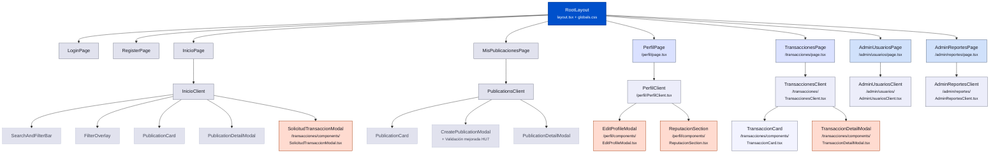

```mermaid

flowchart TB
Root["RootLayout<br><small>layout.tsx + globals.css</small>"] --> Login["LoginPage"] & Register["RegisterPage"] & InicioPage["InicioPage"] & MisPubPage["MisPublicacionesPage"] & PerfilPage["PerfilPage<br><small>/perfil/page.tsx</small>"] & TransaccionesPage["TransaccionesPage<br><small>/transacciones/page.tsx</small>"] & AdminUsuarios["AdminUsuariosPage<br><small>/admin/usuarios/page.tsx</small>"] & AdminReportes["AdminReportesPage<br><small>/admin/reportes/page.tsx</small>"]
InicioPage --> InicioClient["InicioClient"]
InicioClient --> SearchBar["SearchAndFilterBar"] & FilterOv["FilterOverlay"] & PubCard_I["PublicationCard"] & DetailM_I["PublicationDetailModal"] & SolicitudBtn["SolicitudTransaccionModal<br><small>/transacciones/components/<br>SolicitudTransaccionModal.tsx</small>"]
MisPubPage --> PubClient["PublicationsClient"]
PubClient --> PubCard["PublicationCard"] & CreateModal["CreatePublicationModal <br><small>+ Validación mejorada HU7</small>"] & DetailModal["PublicationDetailModal"]
PerfilPage --> PerfilClient["PerfilClient<br><small>/perfil/PerfilClient.tsx</small>"]
PerfilClient --> EditProfileModal["EditProfileModal<br><small>/perfil/components/<br>EditProfileModal.tsx</small>"] & ReputacionSection["ReputacionSection<br><small>/perfil/components/<br>ReputacionSection.tsx</small>"]
TransaccionesPage --> TransClient["TransaccionesClient<br><small>/transacciones/<br>TransaccionesClient.tsx</small>"]
TransClient --> TransCard["TransaccionCard<br><small>/transacciones/components/<br>TransaccionCard.tsx</small>"] & TransDetail["TransaccionDetailModal<br><small>/transacciones/components/<br>TransaccionDetailModal.tsx</small>"]
AdminUsuarios --> AdminUsClient["AdminUsuariosClient<br><small>/admin/usuarios/<br>AdminUsuariosClient.tsx</small>"]
AdminReportes --> AdminRepClient["AdminReportesClient<br><small>/admin/reportes/<br>AdminReportesClient.tsx</small>"]

    style Root fill:#0050cb,color:#fff,stroke:#003fa4,stroke-width:2px
    style Login fill:#e1e2ee,stroke:#727687,color:#191b24
    style Register fill:#e1e2ee,stroke:#727687,color:#191b24
    style InicioPage fill:#e1e2ee,stroke:#727687,color:#191b24
    style MisPubPage fill:#e1e2ee,stroke:#727687,color:#191b24
    style PerfilPage fill:#dae1ff,stroke:#505f76,color:#191b24
    style TransaccionesPage fill:#dae1ff,stroke:#505f76,color:#191b24
    style AdminUsuarios fill:#d0e1fb,stroke:#505f76,color:#191b24
    style AdminReportes fill:#d0e1fb,stroke:#505f76,color:#191b24
    style InicioClient fill:#e1e2ee,stroke:#727687,color:#191b24
    style SearchBar fill:#e1e2ee,stroke:#c2c6d8,color:#424656
    style FilterOv fill:#e1e2ee,stroke:#c2c6d8,color:#424656
    style PubCard_I fill:#e1e2ee,stroke:#c2c6d8,color:#424656
    style DetailM_I fill:#e1e2ee,stroke:#c2c6d8,color:#424656
    style SolicitudBtn fill:#ffdbd0,stroke:#a33200,color:#191b24
    style PubClient fill:#e1e2ee,stroke:#727687,color:#191b24
    style PubCard fill:#e1e2ee,stroke:#c2c6d8,color:#424656
    style CreateModal fill:#e1e2ee,stroke:#c2c6d8,color:#424656
    style DetailModal fill:#e1e2ee,stroke:#c2c6d8,color:#424656
    style PerfilClient fill:#ecedfa,stroke:#727687,color:#191b24
    style EditProfileModal fill:#ffdbd0,stroke:#a33200,color:#191b24
    style ReputacionSection fill:#ffdbd0,stroke:#a33200,color:#191b24
    style TransClient fill:#ecedfa,stroke:#727687,color:#191b24
    style TransCard fill:#f2f3ff,stroke:#727687,color:#191b24
    style TransDetail fill:#ffdbd0,stroke:#a33200,color:#191b24
    style AdminUsClient fill:#ecedfa,stroke:#727687,color:#191b24
    style AdminRepClient fill:#ecedfa,stroke:#727687,color:#191b24
```