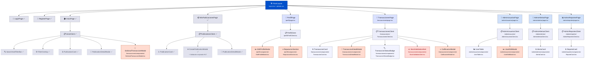

# Árbol de Componentes — Sprint 2

```mermaid
graph TD
    Root["🏗️ RootLayout<br/><small>layout.tsx + globals.css</small>"]

    %% ── Componentes existentes del Sprint 1 ──
    Root --> Login["🔐 LoginPage ✅"]
    Root --> Register["📝 RegisterPage ✅"]
    Root --> InicioPage["🏠 InicioPage ✅"]
    Root --> MisPubPage["📦 MisPublicacionesPage ✅"]

    InicioPage --> InicioClient["📋 InicioClient ✅"]
    InicioClient --> SearchBar["🔍 SearchAndFilterBar ✅"]
    InicioClient --> FilterOv["⚙️ FilterOverlay ✅"]
    InicioClient --> PubCard_I["🃏 PublicationCard ✅"]
    InicioClient --> DetailM_I["📄 PublicationDetailModal ✅"]
    InicioClient --> SolicitudBtn["🔄 SolicitudTransaccionModal<br/><small>/transacciones/components/<br/>SolicitudTransaccionModal.tsx</small>"]

    MisPubPage --> PubClient["📋 PublicationsClient ✅"]
    PubClient --> PubCard["🃏 PublicationCard ✅"]
    PubClient --> CreateModal["➕ CreatePublicationModal ✅<br/><small>+ Validación mejorada HU7</small>"]
    PubClient --> DetailModal["📄 PublicationDetailModal ✅"]

    %% ── HU5: Gestionar Perfil ──
    Root --> PerfilPage["👤 PerfilPage<br/><small>/perfil/page.tsx</small>"]
    PerfilPage --> PerfilClient["📋 PerfilClient<br/><small>/perfil/PerfilClient.tsx</small>"]
    PerfilClient --> EditProfileModal["✏️ EditProfileModal<br/><small>/perfil/components/<br/>EditProfileModal.tsx</small>"]
    PerfilClient --> ReputacionSection["⭐ ReputacionSection<br/><small>/perfil/components/<br/>ReputacionSection.tsx</small>"]

    %% ── HU8, HU9, HU10: Transacciones ──
    Root --> TransaccionesPage["🔄 TransaccionesPage<br/><small>/transacciones/page.tsx</small>"]
    TransaccionesPage --> TransClient["📋 TransaccionesClient<br/><small>/transacciones/<br/>TransaccionesClient.tsx</small>"]
    TransClient --> TransCard["🃏 TransaccionCard<br/><small>/transacciones/components/<br/>TransaccionCard.tsx</small>"]
    TransClient --> TransDetail["📄 TransaccionDetailModal<br/><small>/transacciones/components/<br/>TransaccionDetailModal.tsx</small>"]
    TransClient --> TransStatus["🏷️ TransaccionStatusBadge<br/><small>/transacciones/components/<br/>TransaccionStatusBadge.tsx</small>"]
    TransClient --> StockAlert["⚠️ StockValidationAlert<br/><small>/transacciones/components/<br/>StockValidationAlert.tsx</small>"]
    TransClient --> CalifModal["⭐ CalificacionModal<br/><small>/transacciones/components/<br/>CalificacionModal.tsx</small>"]

    %% ── HU6: Admin - Gestionar Usuarios ──
    Root --> AdminUsuarios["👥 AdminUsuariosPage<br/><small>/admin/usuarios/page.tsx</small>"]
    AdminUsuarios --> AdminUsClient["📋 AdminUsuariosClient<br/><small>/admin/usuarios/<br/>AdminUsuariosClient.tsx</small>"]
    AdminUsClient --> UserTable["📊 UserTable<br/><small>/admin/usuarios/components/<br/>UserTable.tsx</small>"]
    AdminUsClient --> UserEditModal["✏️ UserEditModal<br/><small>/admin/usuarios/components/<br/>UserEditModal.tsx</small>"]

    %% ── HU12: Admin - Alertas de Insumos ──
    Root --> AdminAlertas["🚨 AdminAlertasPage<br/><small>/admin/alertas/page.tsx</small>"]
    AdminAlertas --> AdminAlertClient["📋 AdminAlertasClient<br/><small>/admin/alertas/<br/>AdminAlertasClient.tsx</small>"]
    AdminAlertClient --> AlertaCard["🃏 AlertaCard<br/><small>/admin/alertas/components/<br/>AlertaCard.tsx</small>"]

    %% ── HU13: Admin - Reportes y Control ──
    Root --> AdminReportes["📊 AdminReportesPage<br/><small>/admin/reportes/page.tsx</small>"]
    AdminReportes --> AdminRepClient["📋 AdminReportesClient<br/><small>/admin/reportes/<br/>AdminReportesClient.tsx</small>"]
    AdminRepClient --> ReporteCard["🃏 ReporteCard<br/><small>/admin/reportes/components/<br/>ReporteCard.tsx</small>"]

    %% ── Estilos ──
    style Root fill:#0050cb,color:#fff,stroke:#003fa4,stroke-width:2px

    style Login fill:#e1e2ee,stroke:#727687,color:#191b24
    style Register fill:#e1e2ee,stroke:#727687,color:#191b24
    style InicioPage fill:#e1e2ee,stroke:#727687,color:#191b24
    style MisPubPage fill:#e1e2ee,stroke:#727687,color:#191b24
    style InicioClient fill:#e1e2ee,stroke:#727687,color:#191b24
    style SearchBar fill:#e1e2ee,stroke:#c2c6d8,color:#424656
    style FilterOv fill:#e1e2ee,stroke:#c2c6d8,color:#424656
    style PubCard_I fill:#e1e2ee,stroke:#c2c6d8,color:#424656
    style DetailM_I fill:#e1e2ee,stroke:#c2c6d8,color:#424656
    style PubClient fill:#e1e2ee,stroke:#727687,color:#191b24
    style PubCard fill:#e1e2ee,stroke:#c2c6d8,color:#424656
    style CreateModal fill:#e1e2ee,stroke:#c2c6d8,color:#424656
    style DetailModal fill:#e1e2ee,stroke:#c2c6d8,color:#424656

    style PerfilPage fill:#dae1ff,stroke:#505f76,color:#191b24
    style PerfilClient fill:#ecedfa,stroke:#727687,color:#191b24
    style EditProfileModal fill:#ffdbd0,stroke:#a33200,color:#191b24
    style ReputacionSection fill:#ffdbd0,stroke:#a33200,color:#191b24

    style TransaccionesPage fill:#dae1ff,stroke:#505f76,color:#191b24
    style TransClient fill:#ecedfa,stroke:#727687,color:#191b24
    style TransCard fill:#f2f3ff,stroke:#727687,color:#191b24
    style TransDetail fill:#ffdbd0,stroke:#a33200,color:#191b24
    style TransStatus fill:#f2f3ff,stroke:#727687,color:#191b24
    style StockAlert fill:#ffdad6,stroke:#ba1a1a,color:#93000a
    style CalifModal fill:#ffdbd0,stroke:#a33200,color:#191b24
    style SolicitudBtn fill:#ffdbd0,stroke:#a33200,color:#191b24

    style AdminUsuarios fill:#d0e1fb,stroke:#505f76,color:#191b24
    style AdminUsClient fill:#ecedfa,stroke:#727687,color:#191b24
    style UserTable fill:#f2f3ff,stroke:#727687,color:#191b24
    style UserEditModal fill:#ffdbd0,stroke:#a33200,color:#191b24

    style AdminAlertas fill:#d0e1fb,stroke:#505f76,color:#191b24
    style AdminAlertClient fill:#ecedfa,stroke:#727687,color:#191b24
    style AlertaCard fill:#f2f3ff,stroke:#727687,color:#191b24

    style AdminReportes fill:#d0e1fb,stroke:#505f76,color:#191b24
    style AdminRepClient fill:#ecedfa,stroke:#727687,color:#191b24
    style ReporteCard fill:#f2f3ff,stroke:#727687,color:#191b24
```
